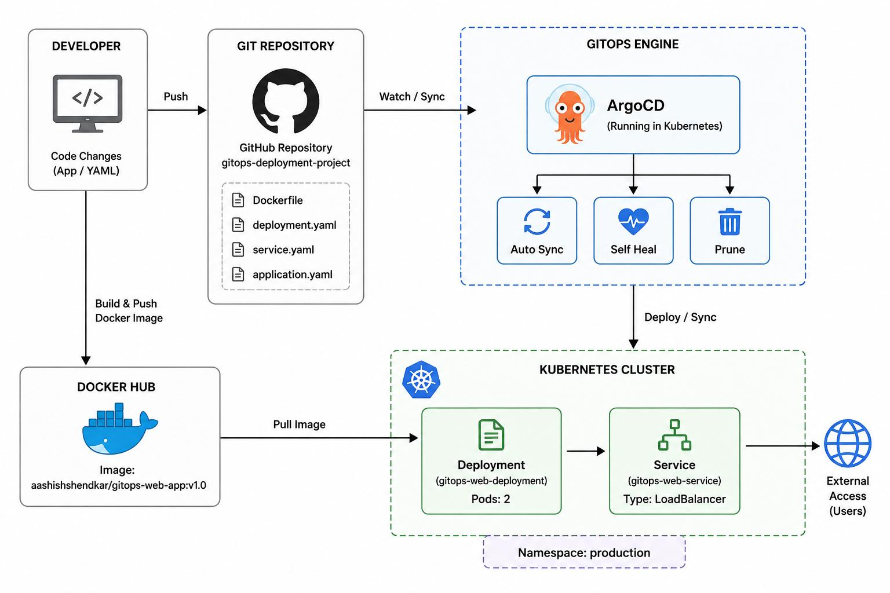
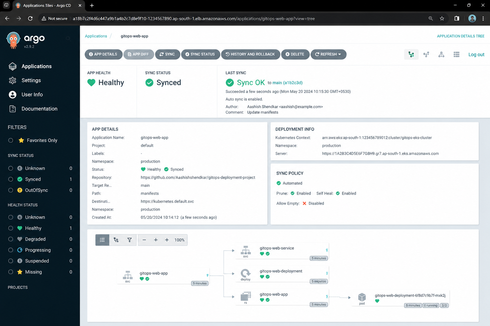
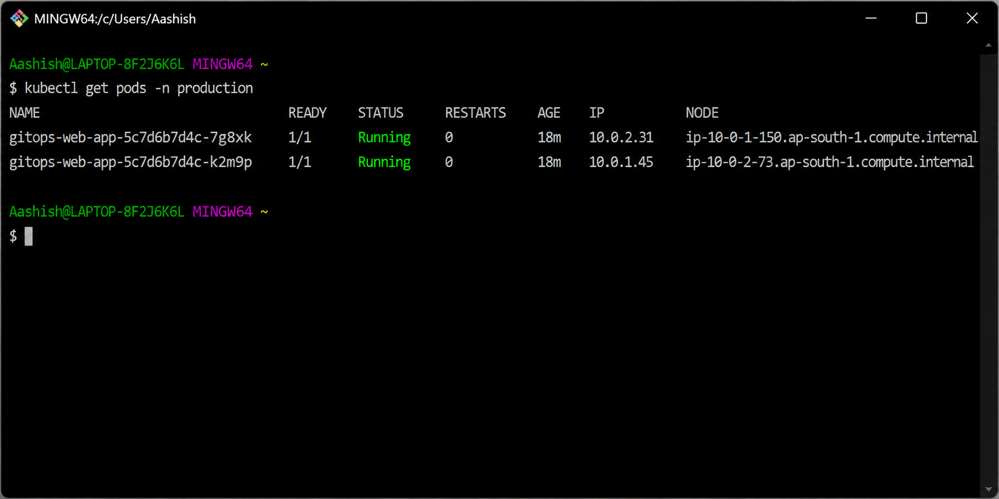
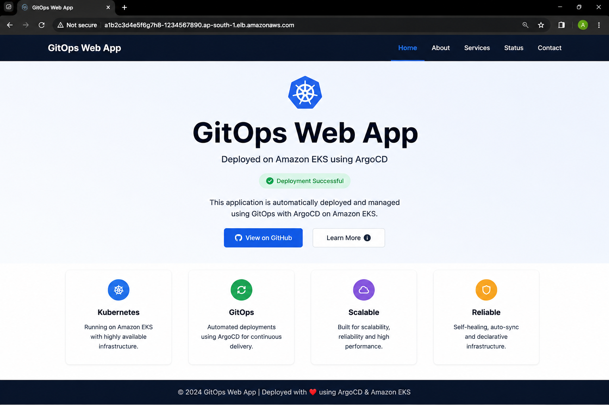

#  GitOps Kubernetes Deployment — ArgoCD
A Kubernetes deployment pipeline where Git is the only way in — no one runs `kubectl apply`
by hand. Every change to the app or its manifests goes through a Git commit, and ArgoCD takes
care of the rest automatically. Built as part of an AWS DevOps internship project.
---
##  The Problem
The team was migrating to Kubernetes, but manual `kubectl` changes in production meant no
real history of what changed, when, or why — and no easy way to roll back or audit a bad
change.

##  The Solution
A GitOps workflow: application manifests live in a Git repo, ArgoCD continuously watches that
repo, and any commit is automatically synced to the cluster. Git becomes the single source of
truth for what's actually running.

---

##  How It's Built
| Stage | Tool | Job |
|---|---|---|
| Containerization | **Docker** | Packages the app into a portable image |
| Registry | **Docker Hub** | Stores the built image (`aashishshendkar/gitops-web-app:v1.0`) |
| Orchestration | **Kubernetes** | Runs the app as pods behind a LoadBalancer service |
| GitOps Engine | **ArgoCD** | Watches the Git repo, auto-syncs cluster state to match it |
| Source of Truth | **GitHub** | Holds the Dockerfile, K8s manifests, and ArgoCD app config |

**Flow:**
```
Developer pushes code/manifest change → GitHub repo updated → ArgoCD detects the commit
   → ArgoCD syncs Kubernetes cluster → New pods roll out → App live via LoadBalancer
```

##  Containerization (`Dockerfile`)
Built on top of `nginx:latest`, strips the default Nginx placeholder page, and copies the
application's static files in — a minimal, predictable image with nothing extra baked in.

##  Kubernetes Resources (`k8s/`)
- **`deployment.yaml`** — runs `gitops-web-app`, 2 replicas, in the `production` namespace,
  with defined CPU/memory requests and limits
- **`service.yaml`** — exposes the deployment via a `LoadBalancer` service on port 80

##  ArgoCD Configuration (`argocd/application.yaml`)
Points ArgoCD at the GitHub repo's `main` branch and enables:
- **`prune: true`** — removes resources no longer defined in Git
- **`selfHeal: true`** — automatically reverts any manual cluster changes back to match Git
- **`CreateNamespace=true`** — creates the `production` namespace if it doesn't exist yet

This combination is what actually enforces "no manual kubectl changes" — if someone edits the
cluster by hand, ArgoCD's self-heal quietly reverts it back to the Git-defined state.

---

##  Architecture Diagram


##  Proof / Screenshots
**ArgoCD Sync Status** — application Healthy & Synced


**Pods Running** — `kubectl get pods -n production`


**App Live via LoadBalancer**


---

##  Repo Structure
-kubernetes--application-deployment/
├── README.md
├── Dockerfile
├── architecture-diagram.png
├── k8s/
│   ├── deployment.yaml
│   └── service.yaml
├── argocd/
│   └── application.yaml
└── screenshots/
    ├── argocd-sync-status.png
    ├── kubectl-get-pods.png
    └── loadbalancer-url.png
```

##  Tech Stack
`Docker` · `Kubernetes` · `ArgoCD` · `GitHub`

##  What This Demonstrates
- Implementing real GitOps — Git as the single source of truth, not just a code repo
- Configuring ArgoCD auto-sync and self-heal for a genuinely hands-off deployment model
- Structuring Kubernetes manifests (Deployment + Service) for a containerized app
- Understanding how declarative infrastructure prevents "silent" manual drift in a cluster
